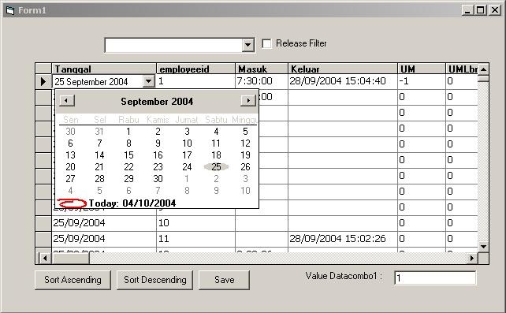



## FexibleDatagrid

### Description

This is Control similar with MS Access Subform, enable you to dirrectly edit, save, sort,etc with datacombo, DTPicker, TextBox, Checkbox inside the datagrid
 
### More Info
 
Because this is vbdatasource type so you need to place a control which bound to this control (this only for trigger the database only).

This is not free bug control, so if you use in your program it is your own risk. But I will do my best to make it up. Just e mail me for the new version of this control

             |
---                |---
**Submitted On**   |2004-10-02 09:27:16
**By**             |[Lucs Comp](https://github.com/Planet-Source-Code/PSCIndex/blob/master/ByAuthor/lucs-comp.md)
**Level**          |Intermediate
**User Rating**    |5.0 (20 globes from 4 users)
**Compatibility**  |VB 6\.0
**Category**       |[Custom Controls/ Forms/  Menus](https://github.com/Planet-Source-Code/PSCIndex/blob/master/ByCategory/custom-controls-forms-menus__1-4.md)
**World**          |[Visual Basic](https://github.com/Planet-Source-Code/PSCIndex/blob/master/ByWorld/visual-basic.md)
**Archive File**   |[FexibleDat1800351042004\.zip](https://github.com/Planet-Source-Code/lucs-comp-fexibledatagrid__1-56512/archive/master.zip)

